# 弹弹堂随便做的版

## 说明

这只是我初学VC++的一个课程设计，只耗时三四个下午。

本来都搭了比较大的框架，但是时间不够，就要交了，所以一些小地方就抓紧补了上去（比如用数组做的地图障碍物，直接用变量1，变量2来代替；还有武器也没有用对应的类）。

下面的内容用的是期末考核的原话，由于老师要求两三页内写完，所以图片什么的都缩小了，可能看不清。

## 相关功能介绍

1、Q版可爱画面：人物角色采取大头小身比例的Q版设计，画面风格清新可爱。

2、自由攻击：不同的武器会发出不同的炮弹，不同的力度、角度也能产生不同的效果

3、障碍物：不同的地图有不同的障碍物，需要玩家熟悉地图，掌握对应的战术。

4、自由位移：进攻时，按F键出现小飞机，蓄力发射小飞机。角色能瞬移降落的地点

5、大招释放：受到进攻时有一定几率触发下一次的大招

6、随机效果：暴击（伤害增半）、格挡（伤害减半）、免疫（无伤害）、吸收（不扣血反而加血），为游戏提供了千变万化的结果。

二、程序的设计

**总体设计类图**：带英文都是里面用到的类

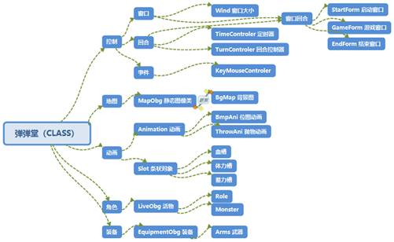

**类的继承与组合**

这是本程序的核心，几乎所有的可见元素都是用类来构造的，比如继承了LiveObg的Role和Monster，组合了Animation类（攻击动画）、Equipment类（装备）、BmpAni类（继承Animation）（人物动画）、Slot类（血槽、体力槽）等……本游戏深度运用了C++的多态性，依赖类的继承与组合来实现多种功能。

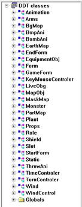

 

三、程序的实现过程

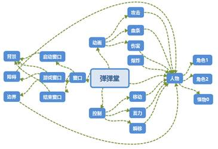

使用TimeControler和TurnControler来控制游戏回合，40ms刷新一次，每秒更新倒计时来判断当前回合是否到时限。

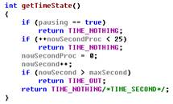

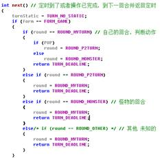

由于使用了自己写的大量封装的类，绘图也十分方便，使用双缓冲调用Role、BgMap等对象的Public绘图函数，如下图。

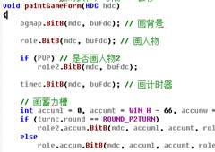 

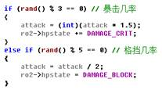

攻击时使用随机函数触发随机效果，如上图。效果显示（暴击格挡等状态、伤害大小、血条减少动画）也是在Role角色类的封装后的绘图函数中。

 

四、程序的运行结果

**启动界面**：左上角启动倒计时，然后进入随机地图

**游戏界面**：随机地图，左上角倒计时，两个角色随机分布两边，最下面是蓄力槽，用来控制攻击力度

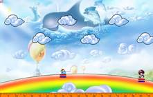

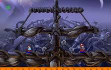

**攻击界面**：蓄力后扔出武器砸向对手，随机触发一些状态：大招、暴击、格挡、免疫、吸收

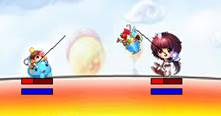

**瞬移操作**：按下F键，出现飞机，可瞬移到飞机能飞到的位置

**结束界面**：GameOver，按空格键重新游戏。

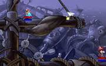

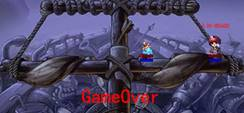

## 编译与运行环境

Windows下的C++即可，没什么特殊要求。